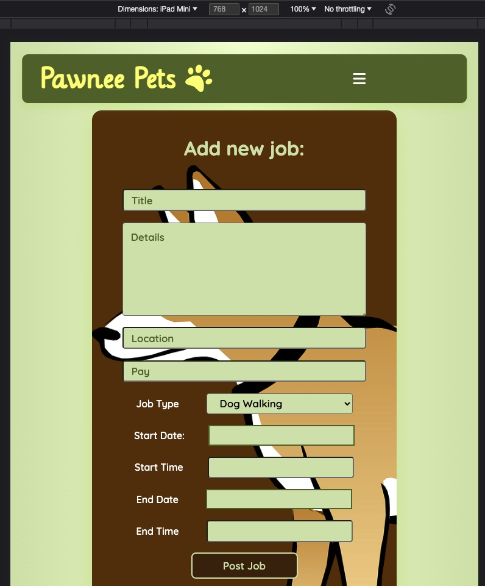

# Project 4 - Full Stack App Rails API + React app

## Overview

1. [Description](#description)
2. [Deployment Links](#deployment-links)
3. [Installation](#installation)
4. [Technologies Used](#technologies)
5. [Deliverables](#deliverables)
6. [Planning/Build Process](#planning)
7. [Challenges](#challenges)
8. [Wins](#wins)
9. [Key Learnings & Takeaways](#takeaways)
10. [Future Improvements](#future-improvements)

<br>

## <a name="description"></a> 1. Description

A fully responsive full-stack job-board application, built from scratch in 10 days using a rails API as its back end and a react-based front end. This solo project was the fourth and final application built as part of the curriculum for the General Assembly Software Engineering Immersive Course.
Featuring freelance jobs posted by pet owners, the application enables users to make an account and post job listings looking for dog-walkers or pet sitters. Once logged in they can view their listings as well as edit and delete them. They can also update their account information and delete their account.

 
 
 


## <a name="deployment-links"></a> 2. Deployment Links

- Front End: React application deployed on Netlify

  - Deployment: https://pawneepets.netlify.app/

- Back End: rails application deployed on Heroku
  - Deployment: https://p4-rails.herokuapp.com
  - Back end GitHub repository: https://github.com/catherineloesch/project4-rails-api

## <a name="installation"></a> 3. Installation

### Front end dependencies:

- package manager used: npm - v9.6.7
  - https://www.npmjs.com/package/npm
- to install dependencies, run:

```zsh
npm install
```

<br>

### Back end dependencies:

- package manager used: bundler
  - https://bundler.io/
- to install dependencies, run:

```zsh
bundle install
```

## <a name="technologies"></a> 4. Technologies Used

### Front End

- The front end of this application is based in ReactJS (v18.2.0), JavaScript, JSX and CSS.
  - it was created using the 'create-react-app' command
  - https://create-react-app.dev/

```zsh
npx create-react-app project4-react-frontend
```

- routing:
  - react-router (v6.11.2)
    - https://www.npmjs.com/package/react-router
  - react-router-dom (v6.11.2)
    - https://www.npmjs.com/package/react-router-dom
- authentication:
  - buffer (v6.0.3)
    - https://nodejs.org/api/buffer.html
    - used to decode JWT tokens
- UI:
  - react-datepicker (v4.12.0)
    - https://www.npmjs.com/package/react-datepicker
  - fonts:
    - 'Lilly Regular' by Apostrophic Labs
      - source: Font Squirrel
      - https://www.fontsquirrel.com/fonts/lilly
    - 'Quicksand' by Andrew Paglinawan
      - source: BestFonts.pro
      - 'https://en.bestfonts.pro/font/quicksand',
    - .woff files: assets/fonts directory
  - icons:
    - source: Font Awesome
    - https://fontawesome.com/
    - details: assets/fonts/icons.js

### Back End

- The back end is based on ruby (v3.2.2) and rails (v7.0.5)
  - it was created using the 'rails new' command with '--api' flag as rails was only used for the backend API rather a full-stack application
  - https://guides.rubyonrails.org/api_app.html

```zsh
rails new p4-rails --api
```

- ruby gems:
  - rack-cors gem (v2.0.1)
    - middleware to make Rack-based apps CORS compatible
    - https://rubygems.org/gems/rack-cors/versions/1.1.1
  - authentication:
    - devise (v4.9.2)
      - https://rubygems.org/gems/devise/versions/4.9.2
    - devise-jwt (v0.11.0)
      - https://rubygems.org/gems/devise-jwt/versions/0.11.0
    - jsonapi-serializer (v2.2.0)
      - https://rubygems.org/gems/jsonapi-serializer/versions/2.2.0

### Additional tools used:

- Netlify
  - used to deploy the front end
  - https://www.netlify.com/
- Heroku
  - used to deploy the back end
  - https://www.heroku.com/
- Postman
  - used to test the API endpoints
  - https://www.postman.com/
- Excalidraw
  - used for building the wireframe + ERD
  - https://excalidraw.com/
- Git / GitHub
  - used for version control
  - https://git-scm.com/
  - https://github.com/https://github.com/
- Visual Studio Code (VSCode)
  - code editor used for writing CSS, JSX, JavaScript and ruby.
- Google Chrome browser
  - used for launching the website and displaying the application Google Chrome
- Google Chrome Developer Tools: For troubleshooting and debugging
  - https://www.google.com/intl/en_uk/chrome/

### Resources

- Dakota Lee Martinez:
  - https://dakotaleemartinez.com/tutorials/devise-jwt-api-only-mode-for-authentication/
  - https://www.youtube.com/watch?v=wVNQwrALp1A
  - https://github.com/DakotaLMartinez/rails-react-devise-tutorial

## <a name="deliverables"></a> 5. Deliverables

### MVP requriements

- full stack web application
- at least 2 models:
  - full CRUD on at least one of the models
  - add/delete functionality on any remaining models
- authentication
- code:
  - well-structured, readable, efficient and DRY
  - adherence to naming conventions + consistent indentation
  - semantic naming of variables, functions, CSS classes, etc.
  - short and clear functions that follow the single responsibility principle

### Stretch Goals

- incorporation of a 3rd party API
- high quality, professional design
- mobile responsive design
- Redux
- inclusion of automated tests using Jest / RSpec or MiniTest for Rails

## <a name="planning"></a>6. Planning / Build Process

### Timeframe

- the deliverables for this project were issued on: 26/05/2023

  - a project proposal was to be submitted and approved by the instructional team before moving on to coding phase of the project
  - the proposal was to include:
    - a description of the project
    - an ERD of models (Entity relationship diagram)
    - user stories
    - a wireframe
    - choice of technology stack, giving students the choice between 3 options:
      1. Full-Stack Rails App
      2. Rails API with React Front-End
      3. Express API with React Front-End

- Submission deadline + project presentation on: 12/05/2023

### Propsal: ERD


<br>

### Proposal: User stories

- As a user I should be able to register with a username and password.
- As a user I should be able to log in with my username and password.
- As a user I should be able to view all job postings.
- As a user I should be able to view my job postings.
- As a user I should be able to write a new job posting.
- As a user I should be able to delete my postings.
- As a user I should be able to edit my postings.
- As a user I should be able to log out of my account.

<br>

### Proposal: Wireframe

 

### Proposal: choice of technology stack

- I dediced to use a rails API with a React Front-End as I had used these 2 technologies before separately but not yet combined together.

### Proposal: submission

- I submitted my project proposal on 30/05/2023 and the instructional team approved it later that same day.
- I started the development process the next day.

### Development: day 1 - 31/05/2023

I started the development process by writing the code for the backend models: the User and Job models.
When I originally generated these models I did so without implementing authentication.
After some research I realised that when using the devise package for authentication, it is more straightforward to generate the User model with devise.
Since I was still early in the backend development process, I decided to start over from scratch and generated the User model with devise, following along the steps listed in the documumentation by Dakota Lee Martinez: https://dakotaleemartinez.com/tutorials/devise-jwt-api-only-mode-for-authentication/.

This documentation also recommends installing the following gems:

- rack-cors
- devise
- devise-jwt
- jsonapi-serializer

After installing the gems, I used the recommended command to generate the User model with devise:

```zsh
rails generate devise User
```

Next, I generated the Job model manually (the same way I had done before) and also created and migrated the database. Folling the migration I made sure both the tables for users and jobs would appear in the Schema file:

```ruby

  create_table "jobs", force: :cascade do |t|
    t.integer "user_id", null: false
    t.string "title"
    t.string "description"
    t.string "job_type"
    t.string "location"
    t.integer "applications"
    t.date "start_date"
    t.time "start_time"
    t.date "end_date"
    t.time "end_time"
    t.string "pay"
    t.datetime "created_at", null: false
    t.datetime "updated_at", null: false
    t.index ["user_id"], name: "index_jobs_on_user_id"
  end

  create_table "users", force: :cascade do |t|
    t.string "email", default: "", null: false
    t.string "encrypted_password", default: "", null: false
    t.string "reset_password_token"
    t.datetime "reset_password_sent_at"
    t.datetime "remember_created_at"
    t.datetime "created_at", null: false
    t.datetime "updated_at", null: false
    t.string "username"
    t.string "display_name"
    t.string "address"
    t.string "description"
    t.integer "age"
    t.string "jti", null: false
    t.index ["email"], name: "index_users_on_email", unique: true
    t.index ["jti"], name: "index_users_on_jti", unique: true
    t.index ["reset_password_token"], name: "index_users_on_reset_password_token", unique: true
  end

```

I then followed along the documentation further to create the controllers and routes for the User model, resulting in a SessionsController, a, RegistrationsController and a CurrentUserController:

```ruby

class Users::RegistrationsController < Devise::RegistrationsController
  include RackSessionFix
  protect_from_forgery with: :null_session
  before_action :configure_sign_up_params, only: [:create]
  respond_to :json
  private

  def respond_with(resource, _opts = {})
    if request.method == "POST" && resource.persisted?
      render json: {
        status: {code: 200, message: "Sign up successful. New user created."},
        data: UserSerializer.new(resource).serializable_hash[:data][:attributes]
      }, status: :ok
    elsif request.method == "DELETE"
      render json: {
        status: { code: 200, message: "Account deleted successfully."}
      }, status: :ok
    else
      render json: {
        status: {code: 422, message: "Error: user couldn't be created successfully. #{resource.errors.full_messages.to_sentence}"}
      }, status: :unprocessable_entity
    end
  end

  def configure_sign_up_params
    devise_parameter_sanitizer.permit(:sign_up, keys: [:age, :description, :username, :address, :display_name])
  end

end


class Users::SessionsController < Devise::SessionsController
  include RackSessionFix
  protect_from_forgery with: :null_session
  respond_to :json
  private

  def respond_with(resource, _opts = {})
    render json: {
      status: {code: 200, message: 'User logged in sucessfully.'},
      data: UserSerializer.new(resource).serializable_hash[:data][:attributes]
    }, status: :ok
  end

  def respond_to_on_destroy
    if current_user
      render json: {
        status: 200,
        message: "User logged out successfully."
      }, status: :ok
    else
      render json: {
        status: 401,
        message: "Couldn't find an active session."
      }, status: :unauthorized
    end
  end
end


class CurrentUserController < ApplicationController
  before_action :authenticate_user!
  def index
    render json: UserSerializer.new(current_user).serializable_hash[:data][:attributes], status: :ok
  end


  def show
    @user = get_user_from_token
    render json: @user

  end


  def jobs
    @user = get_user_from_token
    render json: @user.jobs

  end

  private

  def get_user_from_token
    jwt_payload = JWT.decode(request.headers['Authorization'].split(' ')[1], Rails.application.credentials.fetch(:secret_key_base)).first
    user_id = jwt_payload['sub']
    User.find(user_id.to_s)
  end
end
```

I then created a JobsController as well, implementing all the CRUD operations for the Job model needed for the project:

```ruby
class JobsController < ApplicationController
  before_action :set_job, only: [:show, :edit, :update, :destroy]
  before_action only: [:create, :destroy, :update]

  def index
      @user = User.find(params[:user_id])
      @jobs = @user.jobs
      render json: @jobs
  end

  def all
      @jobs = Job.all
      render json: @jobs
  end

  def one
    @job = Job.find(params[:id])
    render json: @job

  end

  def show
      render json: @job
  end

  def create
    @user = User.find(params[:user_id])
    @job = @user.jobs.create(job_params)
    if @job.valid?
      render json: @job
    else
      render json: @job.errors, status: :unprocessable_entity
    end
  end

  def update
      if @job.update(job_params)
        render json: @job
      else
        render json: @job.errors, status: :unprocessable_entity
      end
  end

  def destroy
      @job.destroy
      render json: @job
  end

  private
  def set_job
      @job = User.find(params[:user_id]).jobs.find(params[:id])
  end

  def job_params
      params.require(:job).permit(:title, :description, :pay, :start_date, :start_time, :end_date, :end_time, :user_id, :job_type, :location)
  end

end
```

I used postman to test out all the endpoints.

```ruby
Rails.application.routes.draw do
  get '/current_user', to: 'current_user#index'
  get '/current_user/info', to: 'current_user#show'

  devise_for :users, path: '', path_names: {
    #POST request to /login
    sign_in: 'login',
    #DELETE request to /logout
    sign_out: 'logout',
    #POST request to /signup
    registration: 'signup'
  },
  controllers: {
    sessions: 'users/sessions',
    registrations: 'users/registrations',
  }

  resources :users do
    resources :jobs do
    end
  end

  get "jobs", to: "jobs#all"
  get "jobs/:id", to: "jobs#one"

end
```

### Development: day 2 - 01/06/2023

Once I was confident that all the routes were working, I deployed the back end rails application on [Heroku](http://www.heroku.com/), so rather than using http://localhost:4000, all requests were now being sent to https://p4-rails.herokuapp.com.

After deploying the backend, I focused on the front end and initialised a new React application using the 'create-react-app' command:

```zsh
npx create-react-app project4-react-frontend
```

I removed all the unncessary boilerplate files that come with a default application and started building the basic folder structure for the front end.

### Development: day 3 - 02/06/2023

I did some reading on useContext as I wanted to use it to keep track of whether a user is logged in or not nad if a user is logged in, I wanted the data of that user to be accessible across all the different react components

created a new file called LoginContext

```JavaScript
import { createContext } from "react";
export const LoginContext = createContext({});

```

Since the App component contains all the other components, it made sense to define the state variables inside App and then share the variables with all its children.

inside the App.js file:

```JavaScript

import { Routes, Route } from 'react-router-dom';
import { LoginContext } from './contexts/LoginContext';
import { useState } from 'react';


function App() {

  const [currentUser, setCurrentUser] = useState(null);
  const [userLoggedIn, setUserLoggedIn] = useState('false');

  return (
    <div className="App">
      <LoginContext.Provider value={{ currentUser, setCurrentUser, userLoggedIn, setUserLoggedIn }}>

        <Header />
        <Routes></Routes>

      </LoginContext.Provider>
    </div>
  );
}

export default App;

```

Thus, I was able to use the userLoggedIn variable in all the child components.
One instance where I made use of this is inside the navbar, in the header.
When no user is logged in, we wan to display the 'Sign Up' and 'Log In' buttons, when a user is logged in we don't want the 'Sign Up' and 'Log In' buttons to show. Instead we want the 'Log out' button to show.

```JavaScript
    const { userLoggedIn } = useContext(LoginContext);

    (!userLoggedIn && <Link to="/users/signup" className='nav-link'><div>Sign Up</div></Link>)
    (!userLoggedIn && <Link to="/users/login" className='nav-link'><div>Login</div></Link>)
    (userLoggedIn && <Link to="/" className='nav-link'><div onClick={handleLogOut}>Log Out</div></Link>)
```

On the third day of development I focused on rendering the API data on the front end.
manged to get full CRUD for job resource
user signup
user login
delete account

### Development: day 4 - 03/06/2023

On day 4 of development I spent some time trying to install Material UI, a CSS framework but ran into some issues as the it didn't seem compatible with the version of React that I was using (v18.2.0). Rather than downgrading to an older version of React, I decided to do the styling in vanilla CSS rather than use a framework.

I also added some custom fonts to the front end, Lilly and Quicksand.

### Development: day 5 - 04/06/2023

On day 5 of development I got started on he styling of the website, starting with the header and the navigation bar. I used @media queries to make the nagivation menu easy to navigate from different screen sizes.


I used several media queries to achieve this, below is the example of one I used for screens smaller than 400px:

```CSS
@media screen and (max-width: 400px) {

    .header {
        height: 115px;
        padding: 3rem 1rem;

    }

    .app-title,  .header .fa-paw { font-size: 1.85rem; }

    .nav .nav-list a { padding: 1rem 0; }

}
```

I added content to the landing page and did the styling.

I also did styling for the input forms.



I also thought it would be nice to have a dropdown menu rather than a simple text field for the user to specify the job type.


### Development: day 6 - 05/06/2023

tested to see that the following 3 routes work in postman:

- POST: https://p4-rails.herokuapp.com/signup -> creates new user+generates token
- POST: https://p4-rails.herokuapp.com/login -> logs user in + creates token
- GET: https://p4-rails.herokuapp.com/current_user -> verifies token and returns user data
- DELETE: https://p4-rails.herokuapp.com/logout -> logs user out

Login
Logout
SignUP

user profile page
update user
delete user

check if token expired

authentication

First we need to get the payload by decoding the token and extracting the part that contains the expiration date
I achieved this using the Buffer library.
The next step is to check the expiration date against the current date. If the expiration date is less than the current date, the token is expired and authentication fails. If the expiration date is greater than the current date authentication is successful.

```Javascript
const decodeToken = (token) => {

    const base64String = token.split('.')[1];
    const decodedValue = JSON.parse(Buffer.from(base64String, 'base64').toString('ascii'));
    return decodedValue;

}

const checkTokenExp = (token_exp) => {
  const currentTime = Math.round(Date.now()/1000)
  return (currentTime < token_exp)

}

export const authenticateUser = () => {
const token = JSON.parse(localStorage.getItem('petsJWT'))

 if ((token !== null && token !== undefined)) {
   const payload = decodeToken(token.token)

   if (payload !== null && payload !== undefined) {
     const userIsAuthenticated = checkTokenExp(payload.exp)
     return userIsAuthenticated
   }
 }
}


```

### Development: day 7 - 06/06/2023

- full CRUD for both User and Job model
- CSS forms for user input

Job cards
date formatting

### Development: day 8 - 08/06/2023

On day 8 of development I tackled the deployment of the front end on [Netlify](http://www.netlify.com/).

I also added styled the dashboard page, including media queries to make the page responsive.


dashboard css, media queries
deletedAccountPage, LogoutSuccessfulPage

### Development: day 9 - 08/06/2023

edit user form css
media queries for profile page
On day 9 I finished the responsive design and created seed data for the rails api.
I also worked on the frontend deployment.

### Development: day 10 - 09/06/2023 - Submission Deadline + presentation

On the final day of this project I completed the readme and presented the project to my cohort.

## 7. <a name="challenges"></a> Challenges

- deployment on the front end proved to be a challenge as there were issues with the fetch requests not working properly.
- I originally created the backend with a sqlite database instead of postgresql and had to later account for that during deployment, which made things more complicated.
- the react-datepicker component I used formatted the date in a different way than the rails datetime format, which required writing some extra code to account for this inconsistency.
- typos

## 8. <a name="wins"></a> Wins

- I managed to fulfil all the MVP requirements.
- I was also really glad that I managed to implement the responsive design for this project withing the timeframe that was given as I had run out of time in previous projects to make the applications fully responsive.
- I successfully implemented authentication with devise which I had not used before in a project.

## <a name="takeaways"></a> 9. Key Learnings & Takeaways

## <a name="future-improvements"></a> 10. Future Improvements

- add 3rd party API
- incorporate Redux
- add automated Tests Using Jest / RSpec or MiniTest for Rails
- add more models e.g. pets
- picture uploads
- user can change password
