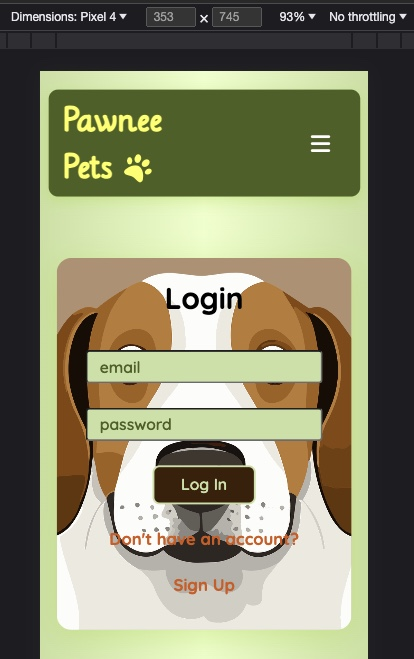
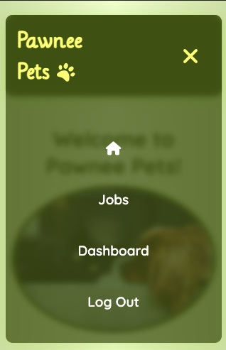

# Project 4 - Full Stack App Rails API + React app

## Overview

1. [Description](#description)
2. [Deployment Links](#deployment-links)
3. [Installation](#installation)
4. [Technologies Used](#technologies)
5. [Deliverables](#deliverables)
6. [Planning](#planning)
7. [Build Process](#build-process)
8. [Challenges](#challenges)
9. [Wins](#wins)
10. [Key Learnings & Takeaways](#takeaways)

<br>

## <a name="description"></a> 1. Description

This project is a fully responsive full-stack web application featuring freelance jobs for animal lovers. Using a rails API as its backend and a react-based front end, this application enables users to make an account and post job listings looking for dog-walkers or pet sitters. Once logged in they can view their listings and edit and delete them. They can also update their account information and delete their account.

 
 

 
 
 
 
 
 
 
 

 
 
 

## <a name="deployment-links"></a> 2. Deployment Links

- Front End: React application deployed on Netlify

  - Deployment: https://pawneepets.netlify.app/

- Back End: rails application deployed on Heroku
  - Deployment: https://p4-rails.herokuapp.com

## <a name="installation"></a> 3. Installation

### Front end dependencies:

- package manager used: npm - v9.6.7
  - https://www.npmjs.com/package/npm
- to install dependencies, run:

```zsh
npm install
```

<br>

### Back end dependencies:

- package manager used: bundler
  - https://bundler.io/
- to install dependencies, run:

```zsh
bundle install
```

## <a name="technologies"></a> 4. Technologies Used

### Front End

- The front end of this application is based in ReactJS (v18.2.0), JavaScript, JSX and CSS.
  - it was created using the 'create-react-app' command

```zsh
create-react-app project4-react-frontend
```

- https://create-react-app.dev/
- routing
  - react-router (v6.11.2)
    - https://www.npmjs.com/package/react-router
  - react-router-dom (v6.11.2)
    - https://www.npmjs.com/package/react-router-dom
- authentication
  - buffer (v6.0.3)
    - https://nodejs.org/api/buffer.html
    - used to decode JWT tokens
- UI
  - react-datepicker (v4.12.0)
  - https://www.npmjs.com/package/react-datepicker
  - fonts:
    - 'Lilly Regular' by Apostrophic Labs
      - source: Font Squirrel
      - https://www.fontsquirrel.com/fonts/lilly
    - 'Quicksand' by Andrew Paglinawan
      - source: BestFonts.pro
      - 'https://en.bestfonts.pro/font/quicksand',
    - .woff files: assets/fonts directory
  - icons
    - source: Font Awesome
    - https://fontawesome.com/
    - details: assets/fonts/icons.js

### Back End

- The back end is based on ruby (v3.2.2) and rails (v7.0.5)
  - it was created using the 'rails new' command with '--api' flag as rails was only used for the backend API rather a full-stack application
  - https://guides.rubyonrails.org/api_app.html

```zsh
rails new p4-rails --api
```

- ruby gems
  - rack-cors gem (v2.0.1)
    - middleware to make Rack-based apps CORS compatible
    - https://rubygems.org/gems/rack-cors/versions/1.1.1
  - authentication:
    - devise (v4.9.2)
      - https://rubygems.org/gems/devise/versions/4.9.2
    - devise-jwt (v0.11.0)
      - https://rubygems.org/gems/devise-jwt/versions/0.11.0
    - jsonapi-serializer (v2.2.0)
      - https://rubygems.org/gems/jsonapi-serializer/versions/2.2.0

### Additional tools used:

- Netlify
  - used to deploy the front end
  - https://www.netlify.com/
- Heroku
  - used to deploy the back end
  - https://www.heroku.com/
- Postman
  - used to test the API endpoints
  - https://www.postman.com/
- excalidraw
  - used for building the wireframe + ERD
  - https://excalidraw.com/
- Git / GitHub
  - used for version control
  - https://git-scm.com/
  - https://github.com/https://github.com/
- Visual Studio Code (VSCode)
  - code editor used for writing CSS, JSX and JavaScript
- Google Chrome browser
  - used for launching the website and displaying the application Google Chrome
- Google Chrome Developer Tools: For troubleshooting and debugging
  - https://www.google.com/intl/en_uk/chrome/

### Resources

- Dakota Lee Martinez:
  - https://dakotaleemartinez.com/tutorials/devise-jwt-api-only-mode-for-authentication/
  - https://www.youtube.com/watch?v=wVNQwrALp1A
  - https://github.com/DakotaLMartinez/rails-react-devise-tutorial

## <a name="deliverables"></a> 5. Deliverables

### MVP

- full stack web application
- at least 2 models
  - full CRUD on at least one of your models
  - be able to Add/Delete on any remaining models
- authentication
- write code that is well-structured, readable, efficient and DRY
  - follow accepted naming conventions + consistent indentation
  - use semantic naming of variables, functions, CSS classes, etc.
  - Short and clear functions that do one thing

### Stretch Goals

- add 3rd party API
- Make app mobile responsive
- High quality, professional design
- Redux
- Automated Tests Using Jest / RSpec or MiniTest for Rails

## User stories

- As a user I should be able to register with a username and password.
- As a user I should be able to log in with my username and password.
- As a user I should be able to view all job postings.
- As a user I should be able to view my job postings.
- As a user I should be able to write a new job posting.
- As a user I should be able to delete my postings.
- As a user I should be able to edit my postings.

---

## <a name="planning"></a>6. Planning

 <br>
 <br>

 
 
 <br>
 <br>

 

<br>

## <a name="planning"></a> 7. Build Process

### start date: 26/05/2023

- specifictions given

### proposal submission deadline: 30/05/2023

- proposal to be submitted for approval by instructional team including:

  - ERD of models
  - wireframe
  - description
  - user stories

- proposal was approved
- once the proposal was approved I started the development process

### development: day 1 - 31/05/2023

On the first day I wrote the code for the backend models for User and Job.
I built the controllers and CRUD actions for those models and started testing them out in postman.

### development: day 2 - 01/06/2023

On day 2 I deployed the backend rails app on heroku.

- initialise react application using command:

```terminal
create-react-app
```

### development: day 3 - 02/06/2023

- start authentication
- add delete account feature for user
- new job form sends data to api
- rendering job resource from api
- add context to keep track of user logged in

### development: day 4 - 03/06/2023

- tried to add Material UI to React project but ran into issues, react version did not work with Material UI
- custom fonts added

### development: day 5 - 04/06/2023

- created third model: applications: join table linking a job posting (by id) with an applicant (by user id).

```ruby
rails g model Application content:string  user:references job:references

rails g controller applications

```

- add content to home page
- add dropdown menu for job_type in AddNewJob form
- add @media queries for header
- toggle hamburger menu
- add fontawesome icons, add css, add responsive navbar
- CSS added
- responsibe navigation bar using vanilla CSS

### development: day 6 - 05/06/2023

- backend deployed on heroku: https://p4-rails.herokuapp.com

tested to see that the following 3 routes work in postman:

- POST: https://p4-rails.herokuapp.com/signup -> creates new user+generates token
- POST: https://p4-rails.herokuapp.com/login -> logs user in + creates token
- GET: https://p4-rails.herokuapp.com/current_user -> verifies token and returns user data
- DELETE: https://p4-rails.herokuapp.com/logout -> logs user out

### development: day 7 - 06/06/2023

- full CRUD for both User and Job model
- CSS forms for user input

### development: day 8 - 08/06/2023

responsive css

### development: day 9 - 08/06/2023

On day 9 I finished the responsive design and created seed data for the rails api.
I also worked on the frontend deployment.

### development: day 10 - 09/06/2023 - Submission Deadline + presentation

On the final day of this project I completed the readme and presented the project to my cohort.

## 8. <a name="challenges"></a> Challenges

- deployment on the front end proved to be a challenge as there were issues with the fetch requests not working properly.
- I originally created the backend with a sqlite database instead of postgresql and had to later account for that during deployment, which made things more complicated.
- the react-datepicker component I used formatted the date in a different way than the rails datetime format, which required writing some extra code to account for this inconsistency.

BUGS:

## 9. <a name="wins"></a> Wins

- I managed to fulfil all the MVP requirements.
- I was also really glad that I managed to implement the responsive design for this project withing the timeframe that was given as I had run out of time in previous projects to make the applications fully responsive.

## 10. <a name="takeaways"></a> 9. Key Learnings & Takeaways

## <a name="future-improvements"></a> 11. Future Improvements

- add 3rd party API
- incorporate Redux
- add automated Tests Using Jest / RSpec or MiniTest for Rails
- add more models e.g. pets
- picture uploads
- user can change password
