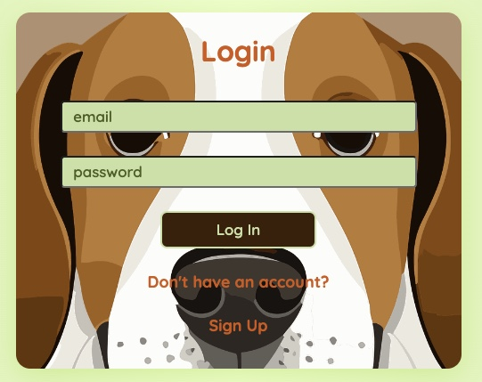
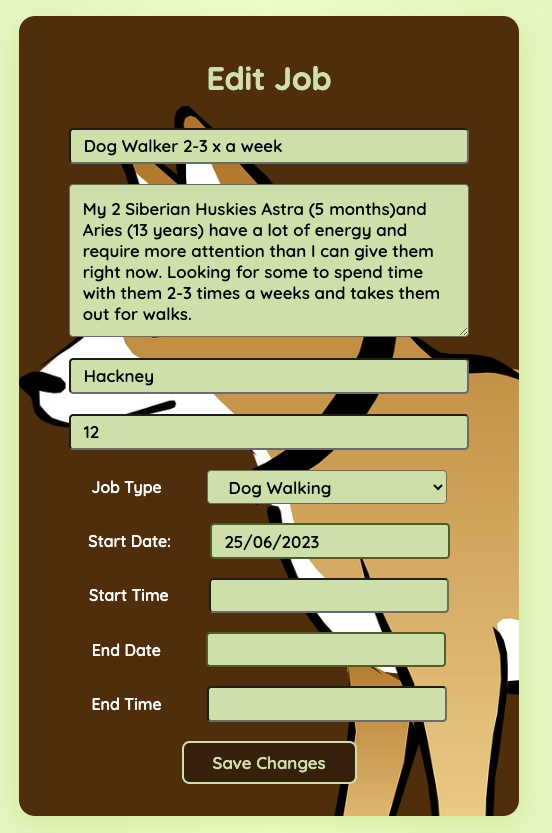

# Project 4 - Rails/React Pet Job Board

## Overview

1. [Description](#description)
2. [Deployment Links](#deployment-links)
3. [Installation](#installation)
4. [Technologies Used](#technologies)
5. [Deliverables](#deliverables)
6. [Planning/Build Process](#planning)
7. [Challenges](#challenges)
8. [Wins](#wins)
9. [Key Learnings & Takeaways](#takeaways)
10. [Future Improvements](#future-improvements)

<br>

## <a name="description"></a> 1. Description

A fully responsive full-stack job-board application, built from scratch in 10 days using a rails API as its back end and a react-based front end. This solo project was the fourth and final application built as part of the curriculum for the General Assembly Software Engineering Immersive Course.
Featuring freelance jobs posted by pet owners, the application enables users to make an account and post job listings looking for dog-walkers or pet sitters. Once logged in they can view their listings as well as edit and delete them. They can also update their account information and delete their account.

 
 
 


## <a name="deployment-links"></a> 2. Deployment Links

- Front end: React application deployed on [Netlify](http://www.netlify.com/)

  - Deployment: https://pawneepets.netlify.app/

- Back end: rails application deployed on [Heroku](http://www.heroku.com/)
  - Deployment: https://p4-rails.herokuapp.com
  - Back end GitHub repository: https://github.com/katieloesch/project4-rails-api

## <a name="installation"></a> 3. Installation

### Front end dependencies:

- package manager used: npm - v9.6.7
  - https://www.npmjs.com/package/npm
- to install dependencies, run:

```zsh
npm install
```

<br>

### Back end dependencies:

- package manager used: bundler
  - https://bundler.io/
- to install dependencies, run:

```zsh
bundle install
```

## <a name="technologies"></a> 4. Technologies Used

### Front End

- The front end of this application is based in ReactJS (v18.2.0), JavaScript, JSX and CSS.
  - it was created using the 'create-react-app' command
  - https://create-react-app.dev/

```zsh
npx create-react-app project4-react-frontend
```

- routing:
  - react-router (v6.11.2)
    - https://www.npmjs.com/package/react-router
  - react-router-dom (v6.11.2)
    - https://www.npmjs.com/package/react-router-dom
- authentication:
  - Buffer (v6.0.3)
    - https://nodejs.org/api/buffer.html
    - used to decode JWT tokens
- UI:
  - react-datepicker (v4.12.0)
    - https://www.npmjs.com/package/react-datepicker
  - fonts:
    - 'Lilly Regular' by Apostrophic Labs
      - source: Font Squirrel
      - https://www.fontsquirrel.com/fonts/lilly
    - 'Quicksand' by Andrew Paglinawan
      - source: BestFonts.pro
      - 'https://en.bestfonts.pro/font/quicksand',
    - .woff files: assets/fonts directory
  - icons:
    - source: Font Awesome
    - https://fontawesome.com/
    - details: assets/fonts/icons.js

### Back End

- The back end is based on ruby (v3.2.2) and rails (v7.0.5)
  - it was created using the 'rails new' command with '--api' flag as rails was only used for the backend API rather a full-stack application
  - https://guides.rubyonrails.org/api_app.html

```zsh
rails new p4-rails --api
```

- ruby gems:
  - rack-cors gem (v2.0.1)
    - middleware to make Rack-based apps CORS compatible
    - https://rubygems.org/gems/rack-cors/versions/1.1.1
  - authentication:
    - devise (v4.9.2)
      - https://rubygems.org/gems/devise/versions/4.9.2
    - devise-jwt (v0.11.0)
      - https://rubygems.org/gems/devise-jwt/versions/0.11.0
    - jsonapi-serializer (v2.2.0)
      - https://rubygems.org/gems/jsonapi-serializer/versions/2.2.0

### Additional tools used:

- Netlify
  - used to deploy the front end
  - https://www.netlify.com/
- Heroku
  - used to deploy the back end
  - https://www.heroku.com/
- Postman
  - used to test the API endpoints
  - https://www.postman.com/
- Excalidraw
  - used for building the wireframe + ERD
  - https://excalidraw.com/
- Git / GitHub
  - used for version control
  - https://git-scm.com/
  - https://github.com/https://github.com/
- Visual Studio Code (VSCode)
  - code editor used for writing CSS, JSX, JavaScript and ruby.
- Google Chrome browser
  - used for launching the website and displaying the application Google Chrome
- Google Chrome Developer Tools: For troubleshooting and debugging
  - https://www.google.com/intl/en_uk/chrome/

### Resources

- Dakota Lee Martinez:
  - https://dakotaleemartinez.com/tutorials/devise-jwt-api-only-mode-for-authentication/
  - https://www.youtube.com/watch?v=wVNQwrALp1A
  - https://github.com/DakotaLMartinez/rails-react-devise-tutorial

## <a name="deliverables"></a> 5. Deliverables

### MVP requriements

- full stack web application
- at least 2 models:
  - full CRUD on at least one of the models
  - add/delete functionality on any remaining models
- authentication
- code:
  - well-structured, readable, efficient and DRY
  - adherence to naming conventions + consistent indentation
  - semantic naming of variables, functions, CSS classes, etc.
  - short and clear functions that follow the single responsibility principle

### Stretch Goals

- incorporation of a 3rd party API
- high quality, professional design
- mobile responsive design
- Redux
- inclusion of automated tests using Jest / RSpec or MiniTest for Rails

## <a name="planning"></a>6. Planning / Build Process

### Timeframe

- the deliverables for this project were issued on: 26/05/2023

  - a project proposal was to be submitted and approved by the instructional team before moving on to coding phase of the project
  - the proposal was to include:
    - a description of the project
    - an ERD of models (Entity relationship diagram)
    - user stories
    - a wireframe
    - choice of technology stack, giving students the choice between 3 options:
      1. Full-Stack Rails App
      2. Rails API with React Front-End
      3. Express API with React Front-End

- Submission deadline + project presentation on: 12/05/2023

### Propsal: ERD


<br>

### Proposal: User stories

- As a user I should be able to register with a username and password.
- As a user I should be able to log in with my username and password.
- As a user I should be able to view all job postings.
- As a user I should be able to view my job postings.
- As a user I should be able to write a new job posting.
- As a user I should be able to delete my postings.
- As a user I should be able to edit my postings.
- As a user I should be able to log out of my account.

<br>

### Proposal: Wireframe

 

### Proposal: choice of technology stack

- I dediced to use a rails API with a React front end as I had used these two technologies before separately but not combined.

### Proposal: submission

- I submitted my project proposal on 30/05/2023 and the instructional team approved it later that same day.
- I started the development process the next day.

### Development: day 1 - 31/05/2023

I started the development process by writing the code for the backend models: the User and Job models.
When I originally generated these models I did so without implementing authentication.
After some research I realised that when using the devise package for authentication, it is more straightforward to generate the User model with devise.
Since I was still early in the back end development process, I decided to start the back end from scratch. Thus, I generated the User model with devise, following along the steps listed in the [documumentation by Dakota Lee Martinez](https://dakotaleemartinez.com/tutorials/devise-jwt-api-only-mode-for-authentication/). This documentation recommends installing the following gems:

- rack-cors
- devise
- devise-jwt
- jsonapi-serializer

After installing the gems, I used the recommended command to generate the User model with devise:

```zsh
rails generate devise User
```

Next, I generated the Job model (without devise) and also created and migrated the database. Following the migration I made sure both the tables for users and jobs would appear in the Schema file:

```ruby

  create_table "jobs", force: :cascade do |t|
    t.integer "user_id", null: false
    t.string "title"
    t.string "description"
    t.string "job_type"
    t.string "location"
    t.integer "applications"
    t.date "start_date"
    t.time "start_time"
    t.date "end_date"
    t.time "end_time"
    t.string "pay"
    t.datetime "created_at", null: false
    t.datetime "updated_at", null: false
    t.index ["user_id"], name: "index_jobs_on_user_id"
  end

  create_table "users", force: :cascade do |t|
    t.string "email", default: "", null: false
    t.string "encrypted_password", default: "", null: false
    t.string "reset_password_token"
    t.datetime "reset_password_sent_at"
    t.datetime "remember_created_at"
    t.datetime "created_at", null: false
    t.datetime "updated_at", null: false
    t.string "username"
    t.string "display_name"
    t.string "address"
    t.string "description"
    t.integer "age"
    t.string "jti", null: false
    t.index ["email"], name: "index_users_on_email", unique: true
    t.index ["jti"], name: "index_users_on_jti", unique: true
    t.index ["reset_password_token"], name: "index_users_on_reset_password_token", unique: true
  end

```

I then followed along further with the [documentation](https://dakotaleemartinez.com/tutorials/devise-jwt-api-only-mode-for-authentication/) and created the controllers and routes for the User model, resulting in 3 controllers for the User model:

- a SessionsController
- a RegistrationsController
- a CurrentUserController

```ruby
class Users::RegistrationsController < Devise::RegistrationsController
  include RackSessionFix
  protect_from_forgery with: :null_session
  before_action :configure_sign_up_params, only: [:create]
  respond_to :json
  private

  def respond_with(resource, _opts = {})
    if request.method == "POST" && resource.persisted?
      render json: {
        status: {code: 200, message: "Sign up successful. New user created."},
        data: UserSerializer.new(resource).serializable_hash[:data][:attributes]
      }, status: :ok
    elsif request.method == "DELETE"
      render json: {
        status: { code: 200, message: "Account deleted successfully."}
      }, status: :ok
    else
      render json: {
        status: {code: 422, message: "Error: user couldn't be created successfully. #{resource.errors.full_messages.to_sentence}"}
      }, status: :unprocessable_entity
    end
  end

  def configure_sign_up_params
    devise_parameter_sanitizer.permit(:sign_up, keys: [:age, :description, :username, :address, :display_name])
  end

end


class Users::SessionsController < Devise::SessionsController
  include RackSessionFix
  protect_from_forgery with: :null_session
  respond_to :json
  private

  def respond_with(resource, _opts = {})
    render json: {
      status: {code: 200, message: 'User logged in sucessfully.'},
      data: UserSerializer.new(resource).serializable_hash[:data][:attributes]
    }, status: :ok
  end

  def respond_to_on_destroy
    if current_user
      render json: {
        status: 200,
        message: "User logged out successfully."
      }, status: :ok
    else
      render json: {
        status: 401,
        message: "Couldn't find an active session."
      }, status: :unauthorized
    end
  end
end


class CurrentUserController < ApplicationController
  before_action :authenticate_user!
  def index
    render json: UserSerializer.new(current_user).serializable_hash[:data][:attributes], status: :ok
  end


  def show
    @user = get_user_from_token
    render json: @user

  end


  def jobs
    @user = get_user_from_token
    render json: @user.jobs

  end

  private

  def get_user_from_token
    jwt_payload = JWT.decode(request.headers['Authorization'].split(' ')[1], Rails.application.credentials.fetch(:secret_key_base)).first
    user_id = jwt_payload['sub']
    User.find(user_id.to_s)
  end
end
```

I then created a JobsController as well, implementing all the CRUD actions for the Job model needed for the project:

```ruby
class JobsController < ApplicationController
  before_action :set_job, only: [:show, :edit, :update, :destroy]
  before_action only: [:create, :destroy, :update]

  def index
      @user = User.find(params[:user_id])
      @jobs = @user.jobs
      render json: @jobs
  end

  def all
      @jobs = Job.all
      render json: @jobs
  end

  def one
    @job = Job.find(params[:id])
    render json: @job

  end

  def show
      render json: @job
  end

  def create
    @user = User.find(params[:user_id])
    @job = @user.jobs.create(job_params)
    if @job.valid?
      render json: @job
    else
      render json: @job.errors, status: :unprocessable_entity
    end
  end

  def update
      if @job.update(job_params)
        render json: @job
      else
        render json: @job.errors, status: :unprocessable_entity
      end
  end

  def destroy
      @job.destroy
      render json: @job
  end

  private
  def set_job
      @job = User.find(params[:user_id]).jobs.find(params[:id])
  end

  def job_params
      params.require(:job).permit(:title, :description, :pay, :start_date, :start_time, :end_date, :end_time, :user_id, :job_type, :location)
  end

end
```

### Development: day 2 - 01/06/2023

I tested all the different routes in [Postman](https://www.postman.com/), making sure that:

- sending a POST request to the '/signup' endpoint creates new user and generates a token, along with a 'Sign up successful. New user created.' message
- sending a POST request to the '/login' endpoint logs the user in and generates a token, along with a 'User logged in sucessfully.' message
- sending a GET request to the '/current_user' endpoint with a valid token verifies the token and returns the data for the user associated with the token
- sending a DELETE request to the '/logout' endpoint logs the user out and returns a "User logged out successfully." message
- all CRUD actions defined in the JobsController work as expected

Once I was confident that all the routes were working, I deployed the back end rails application on [Heroku](http://www.heroku.com/), so rather than using http://localhost:4000, all requests were now being sent to https://p4-rails.herokuapp.com.

After deploying the back end, I focused on the front end and initialised a new React application using the 'create-react-app' command:

```zsh
npx create-react-app project4-react-frontend
```

I removed all the unncessary boilerplate files that come with a default application and started building the basic folder structure for the front end.

### Development: day 3 - 02/06/2023

On the third day of development, I did some research on useContext hook in React, as I wanted to use it to keep track of whether a user is logged in or not and if a user is logged in, I wanted the data of that user to be accessible across all the different React components. To do this, I first created a new file called LoginContext.js with the following lines:

```JavaScript
import { createContext } from "react";
export const LoginContext = createContext({});

```

Since the `<App>` component is high up in the hierarchy and contains all the other components, it made sense to define the state variables inside the `<App>` component and then share the variables with all its children:

```JavaScript
import { Routes, Route } from 'react-router-dom';
import { LoginContext } from './contexts/LoginContext';
import { useState } from 'react';

function App() {

  const [currentUser, setCurrentUser] = useState(null);
  const [userLoggedIn, setUserLoggedIn] = useState('false');

  return (
    <div className="App">
      <LoginContext.Provider value={{ currentUser, setCurrentUser, userLoggedIn, setUserLoggedIn }}>

        <Header />
        <Routes></Routes>

      </LoginContext.Provider>
    </div>
  );
}

export default App;

```

Thus, I was able to use the `userLoggedIn` variable in all the child components. One instance where I made use of this was in the `<Nav>` component inside the `<Header>`.
When no user is logged in, it should display the 'Sign Up' and 'Log In' buttons. However, when a user is logged in, those two buttons should disappear and a 'Log Out' button should appear in the nav bar:

```JavaScript
    const { userLoggedIn } = useContext(LoginContext);

    (!userLoggedIn && <Link to="/users/signup" className='nav-link'><div>Sign Up</div></Link>)
    (!userLoggedIn && <Link to="/users/login" className='nav-link'><div>Login</div></Link>)
    (userLoggedIn && <Link to="/" className='nav-link'><div onClick={handleLogOut}>Log Out</div></Link>)
```

I also made sure that I was able to display data from the backend on the front end, starting with the job resource, first making sure that I could display jobs from the database on the front end and then adding forms to add, edit and delete jobs on the front end.

### Development: day 4 - 03/06/2023

Continuing where I had left off the day before, on day 4 I added more forms to the front end and made sure that the sign up and log in features worked for the User model.
I then proceeded to add the features for updating user information and deleting a user.

I also spent some time trying to install [Material UI](https://mui.com/), an open-source framework for React components. However, I ran into some issues as the it didn't seem compatible with the version of React that I was using (v18.2.0). Rather than downgrading to an older version of React, I decided to do the styling in vanilla CSS instead of using a framework. I also added two custom fonts to the front end, [Lilly](https://www.fontsquirrel.com/fonts/lilly) and [Quicksand](https://en.bestfonts.pro/font/quicksand).

### Development: day 5 - 04/06/2023

On the fifth day of development I tackled the styling of the website, starting with the header and the navigation bar. I used media queries to make the nagivation menu easy to navigate from different screen sizes.


<br>

Next, I added styling to the `<form>` elements. I started with the form that allows the user to post a new job listing. As I was styling the form I added media queries to make the forms responsive:

<br>


I chose to use a dropdown menu rather than a simple text field for the user to specify the job type. For the start date and the end date of the job I wanted the user to be able to select the date from a dropdown calendar. For this used the [React Date Picker](https://www.npmjs.com/package/react-datepicker) component.


### Development: day 6 - 05/06/2023

On day 6 I added styling to the login and signup forms, again writing several media queries for each form to make sure they are easy to navigate on different screen sizes.




After verifying that a user can sign up/log in with a token being issued, I moved on to issue of checking whether or not a token is expired.
As a first step, I wrote a function that decodes the token and extracts the data that contains the expiration date. I achieved this using the [Buffer library](https://vinod827.medium.com/decoding-a-jwt-token-in-nodejs-b8d5d079dea7).

```JavaScript
const decodeToken = (token) => {

    const base64String = token.split('.')[1];
    const decodedValue = JSON.parse(Buffer.from(base64String, 'base64').toString('ascii'));
    return decodedValue;
}
```

The next step was to check the expiration date against the current date. If the expiration date is less than the current date, the token is expired and authentication fails. If the expiration date is greater than the current date, authentication is successful.

```Javascript
const checkTokenExp = (token_exp) => {
  const currentTime = Math.round(Date.now()/1000)
  return (currentTime < token_exp)

}

export const authenticateUser = () => {
const token = JSON.parse(localStorage.getItem('petsJWT'))

 if ((token !== null && token !== undefined)) {
   const payload = decodeToken(token.token)

   if (payload !== null && payload !== undefined) {
     const userIsAuthenticated = checkTokenExp(payload.exp)
     return userIsAuthenticated
   }
 }
}
```

I incorporated the `authenticateUser` function for all the protected routes i.e. routes that should only be accessible with a valid token. If the `authenticateUser` funcion returns `true`, the user can proceed to the requested page. If the `authenticateUser` function returns `false`, the user is redirected to the login page:

```Javascript
    useEffect(() => {
        const auth = authenticateUser()

        if (auth === true) {
            getUser()
            console.log('User authenticated:', auth)
        } else {

        localStorage.removeItem("petsJWT")
          setUserLoggedIn(false)
          setCurrentUser(null)
          navigate(`/users/login`)
        }
      }, [])
```

### Development: day 7 - 06/06/2023

On day 7, I woked on styling the landing page as well as the page that displays all the job postings. I made a reusable card component for each job record, along with media queries to ensure a responsive layout.


### Development: day 8 - 08/06/2023

On day 8 I tackled the deployment of the front end on [Netlify](http://www.netlify.com/). I also added styling to the dashboard page, including media queries to make the page responsive.


### Development: day 9 - 08/06/2023

On day 9, I styled the form that allows the user to edit job postings on the front end alongside some media queries, following the same pattern I used for the form that allows the user to create a new job:




After I finished the styling for the project, I finally created some seed data for the rails api.

### Development: day 10 - 09/06/2023 - Submission Deadline + Presentation

On the final day of this project I added content to the readme document and presented the project to my cohort.

## 7. <a name="challenges"></a> Challenges

- deployment on the front end on Netlify proved to be a challenge as there were issues with the fetch requests not working properly.
- I originally created the backend with a sqlite database instead of postgresql and had to later account for that during deployment, which made things more complicated.
- the react-datepicker component I used formatted the date in a different way than the rails datetime format, which required writing some extra code to account for this inconsistency.
- the [documentation](https://dakotaleemartinez.com/tutorials/devise-jwt-api-only-mode-for-authentication/) I followed to set up devise authentication contained a couple of typos which I only noticed after copying some of the commands to the CLI, which resulted in several error messages.

## 8. <a name="wins"></a> Wins

- I managed to fulfil all the MVP requirements.
- I was glad to have managed the implementation of the responsive design for this project within the given timeframe as I had run out of time in previous projects to make the applications fully responsive.
- I successfully implemented authentication with devise which I had not used before in a project.

## <a name="takeaways"></a> 9. Key Learnings & Takeaways

- It is useful to think about how to implement authentication before generating a User model in the backend.
- Using CSS variables are save a lot of time when programmming in vanilla CSS.
- It is easier to implement a responsive design as you do the styling of different elements rather than leaving it until the final stages of development.
- Always check for typos before copying and pasting commands to the CLI.

## <a name="future-improvements"></a> 10. Future Improvements

- add 3rd party API
- incorporate Redux
- add automated Tests Using Jest / RSpec or MiniTest for Rails
- add more models e.g. pets
- picture uploads
- user can change password
